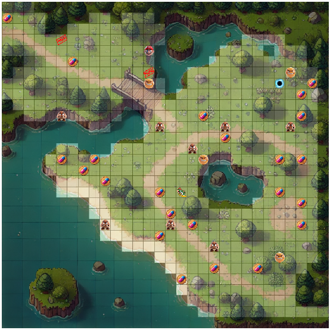
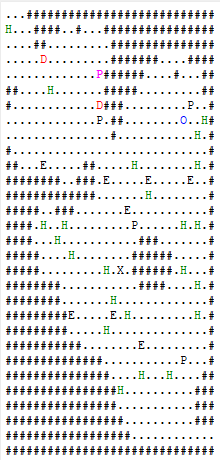

# Scooh - Interactive Multi-Layered Game Engine

## Overview

Scooh is a versatile, interactive game engine featuring multiple representation layers and intelligent pathfinding. The engine provides a rich environment for creating and exploring dynamic worlds with customizable enemies, interactive elements, and multi-layered visualizations.

## Key Features

### Multi-Layered Visualization

- **Graphical View**: Fully-rendered 2D visualization with colored tiles based on traversal difficulty



- **Text-Based View**: ASCII art-like visualization with keyboard command interface



- **Overlay System**: Support for image overlays on data layers, enabling complex world representations while maintaining gameplay mechanics

### Interactive Gameplay

- **Intelligent Pathfinding**: Advanced algorithm for protagonist movement
- **Command System**: Extensible text command system with tab completion
- **Multiple Enemy Types**: 
  - Standard enemies
  - Poison enemies (PEnemies) that inflict damage over time
  - Special enemies (XEnemies) with unique behaviors (teleportation, resurrection, etc.)

### Level Management

- **Portal System**: Seamless transition between different world maps
- **Level Caching**: Optimized memory management for quick level transitions
- **Custom Level Creation**: Design levels using simple image files where pixel values determine traversal difficulty

### User Interface

- **Health & Energy Monitoring**: Real-time status display
- **View Switching**: Toggle between graphical and text-based representations
- **Zoom Controls**: Dynamic zoom capability for detailed exploration
- **Command Console**: Integrated command input for text mode

### Advanced Features

- **Save/Load System**: Preserve and restore game state
- **Dynamic World Interaction**: Real-time protagonist feedback for actions like attacking, healing, and movement
- **World Customization**: Tools for customizing maps and enemy placement

## Getting Started

### Prerequisites

- Qt 6.x or higher
- C++17 compatible compiler

### Installation

1. Clone the repository:
   ```
   git clone https://github.com/ekiciact/fa.git
   ```

2. Navigate to the project directory:
   ```
   cd fa
   ```

3. Build the project using Qt Creator or command line:
   ```
   qmake
   make
   ```

4. Run the application:
   ```
   ./scooh
   ```

## Usage

### Graphical Mode

- **Left-click**: Move protagonist to selected tile
- **Right-click**: Attack nearest enemy
- **Middle-click**: Use health pack
- **Scroll wheel**: Zoom in/out

### Text Mode

Available commands:
- `up`, `down`, `left`, `right`: Move in specified direction
- `goto x y`: Move to specific coordinates using pathfinding
- `attack`: Attack nearest enemy
- `take`: Collect nearest health pack
- `help`: Display available commands

## Architecture

Scooh is built on a robust Model-View-Controller architecture:

- **Model**: Core game logic and world representation
- **View**: Multiple visualization strategies (graphical, text-based)
- **Controller**: User input handling and command processing

The design follows SOLID principles for maintainability and extensibility, with smart pointers used throughout to manage memory efficiently.

## Special Features

### XEnemy Implementation

The XEnemy extends the standard enemy class with teleportation capabilities. When hit, the XEnemy teleports to a different location on the map, requiring strategic planning to defeat.

### Level Transition

The portal system allows seamless transitions between different world maps, maintaining the protagonist's state while loading new environments.

### Command Parser

The extensible command parser interprets text-based commands and translates them to game actions, enabling full control of the game through text input.

## License

This project is licensed under the MIT License - see the LICENSE file for details.

## Acknowledgments

- Qt framework for UI components
- The Scooh development team for their dedication and creativity 
